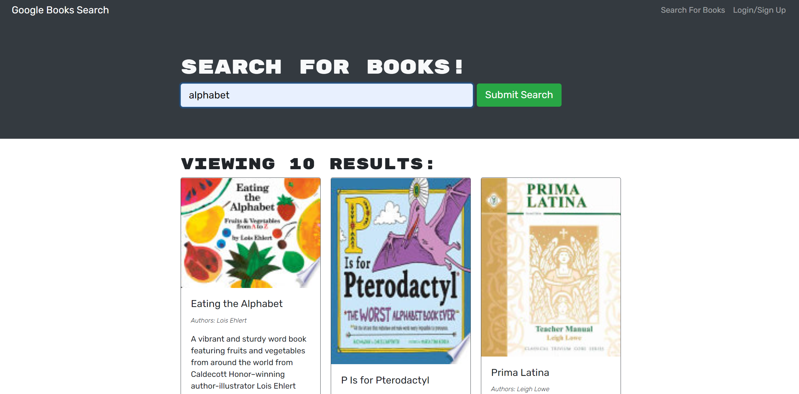

# MERN Book Search Engine

## License:

## Contents

- [Description](#description)
- [Installation](#installation)
- [Usage](#usage)

## Description:

This project fully functioning Google Books API search engine built with a RESTful API, and refactor it to be a GraphQL API built with Apollo Server.
The app was built using the MERN stack with a React front end, MongoDB database, and Node.js/Express.js server and API.

## Installation:

You can clone the repo, install all dependencies, and run mongo DB. For a better user experience you can also use the deployed app.

## Usage:

User can type a search term (in this case, "star wars") in a search box and the results appear. User can save books by clicking "Save This Book!" under each search result.

[Book Search Engine (Heroku App)](https://warm-escarpment-28949.herokuapp.com/)

## Contact:

- Github: [zahra315](https://github.com/zahra315)
